# Obserwacje do wyników w Laboratorium 6 z modelami LSTM i GRU dla akcji IBM

## podstawowa konfiguracja bez Early Stopping:

### LSTM:

#### konfiguracja: 
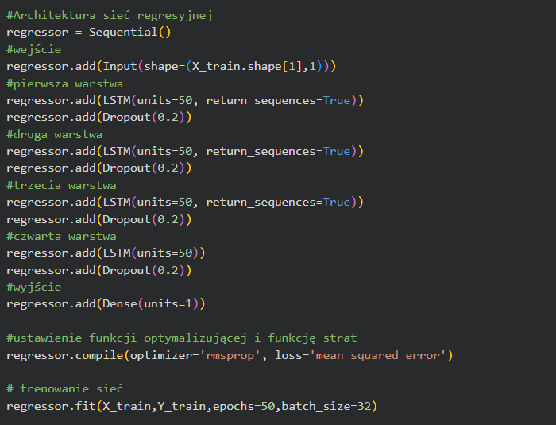

#### trening modelu: 
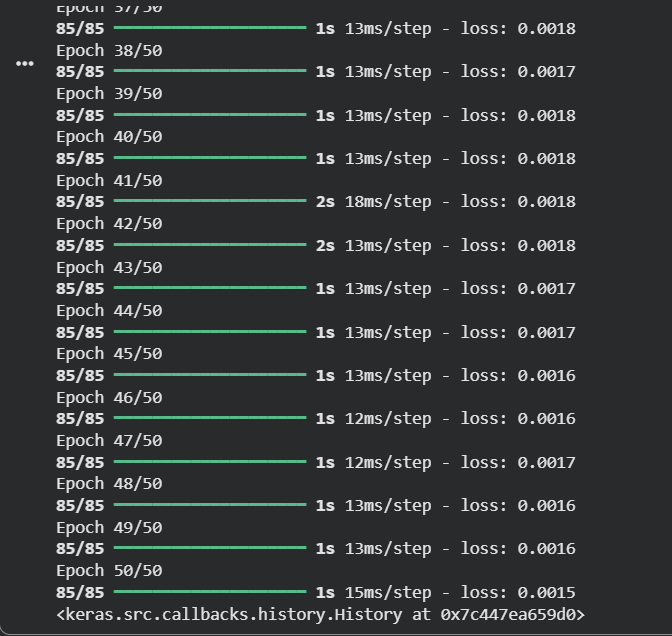

#### wizualizacja wyników: 
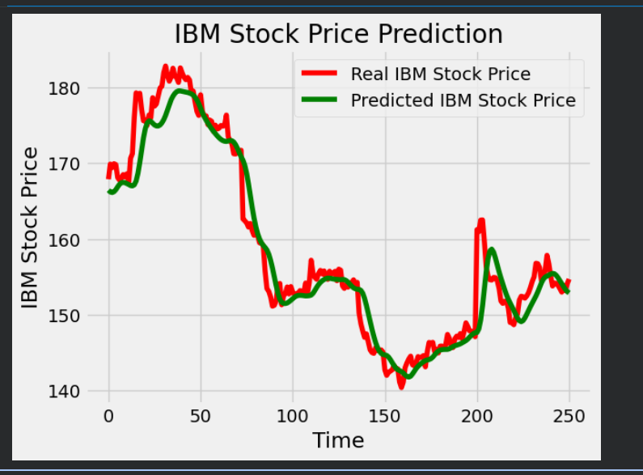 

#### ocena modelu: 
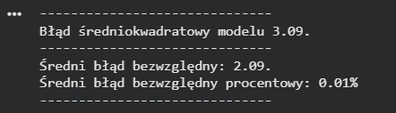

### GRU:

#### konfiguracja: 
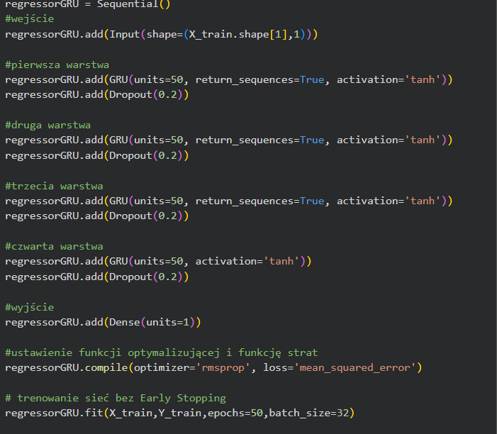

#### trening modelu: 
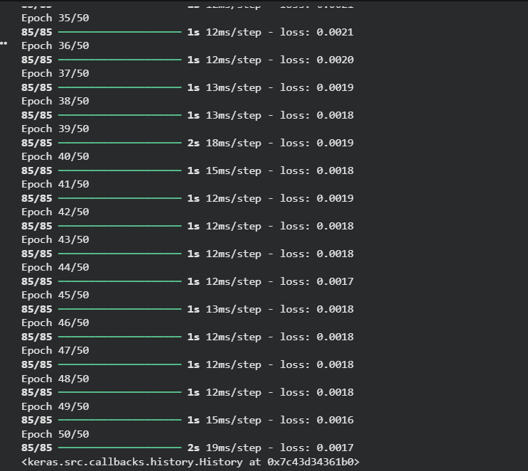

#### wizualizacja wyników:  
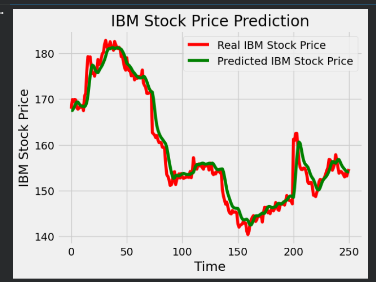

#### ocena modelu: 
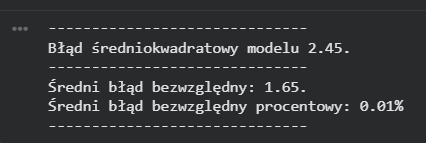

## Eksperymenty z zmianą ilość jednostek LSTM 

### zwiększenie jednostek z 50 do 100 dla LSTM:

#### konfiguracja: 
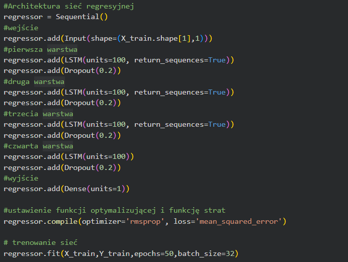

#### trening modelu: 
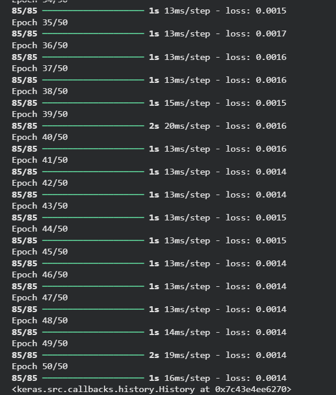

#### wizualizacja wyników: 
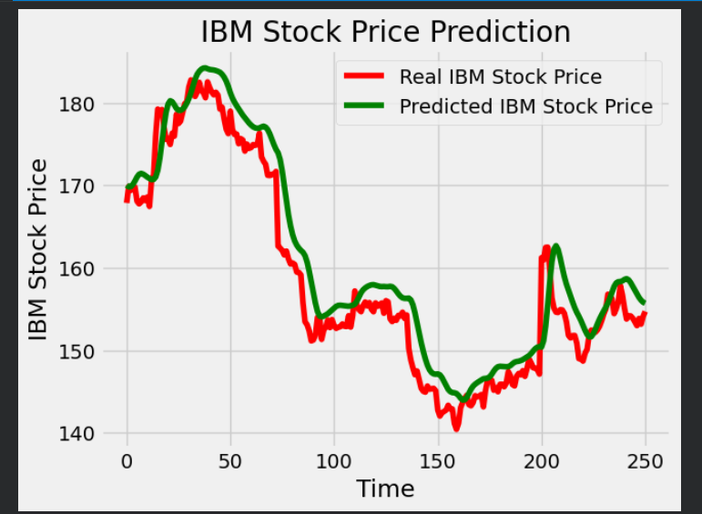 

#### ocena modelu: 
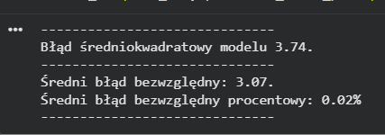

### ustawienie 500 jednostek dla LSTM:

#### konfiguracja: 
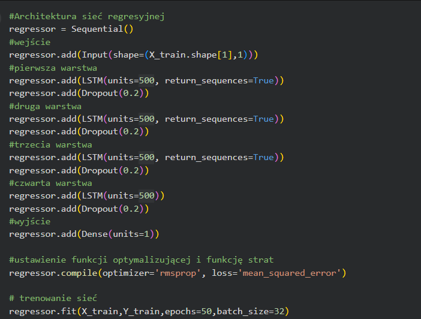

#### trening modelu: 
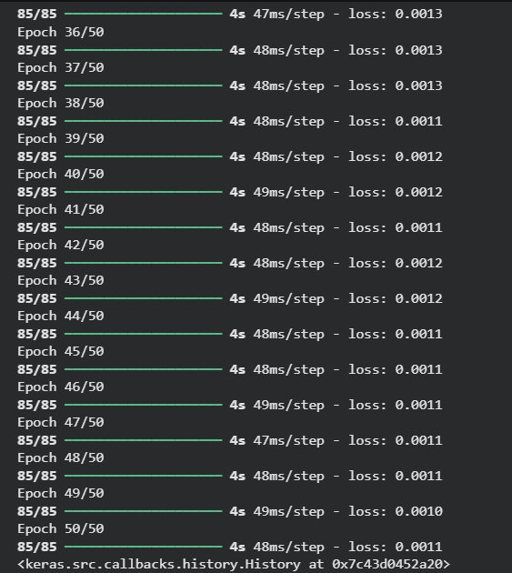

#### wizualizacja wyników: 
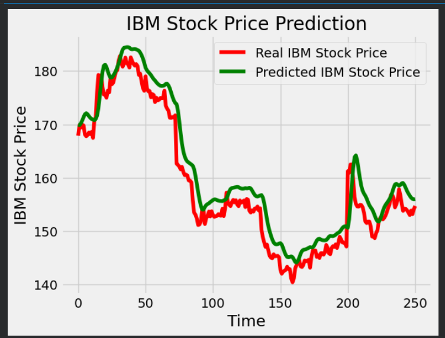 

#### ocena modelu: 
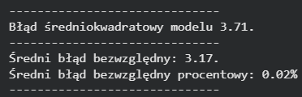

### ustawienie 20 jednostek dla LSTM:

#### konfiguracja: 
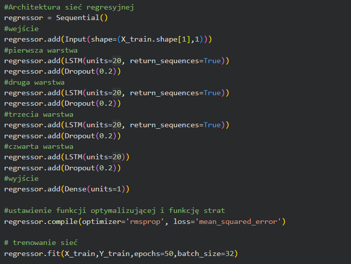

#### trening modelu: 
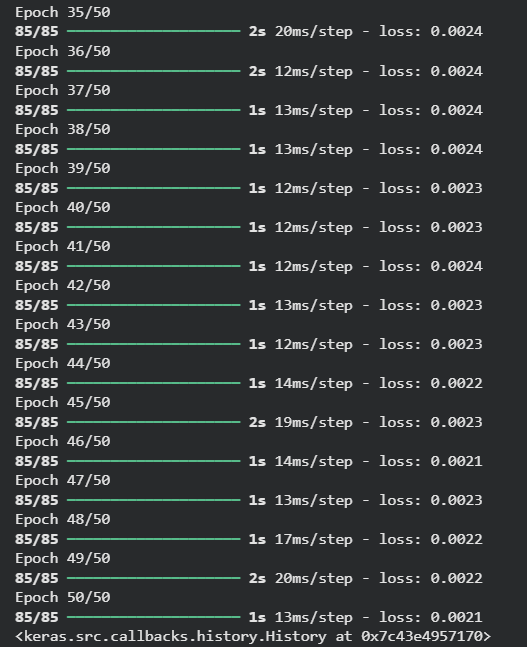

#### wizualizacja wyników: 
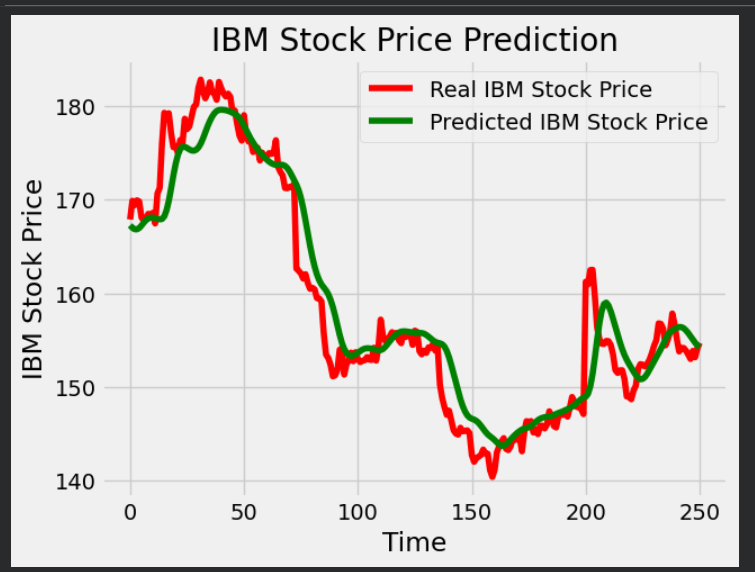

#### ocena modelu: 
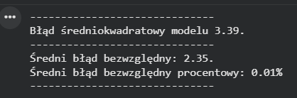